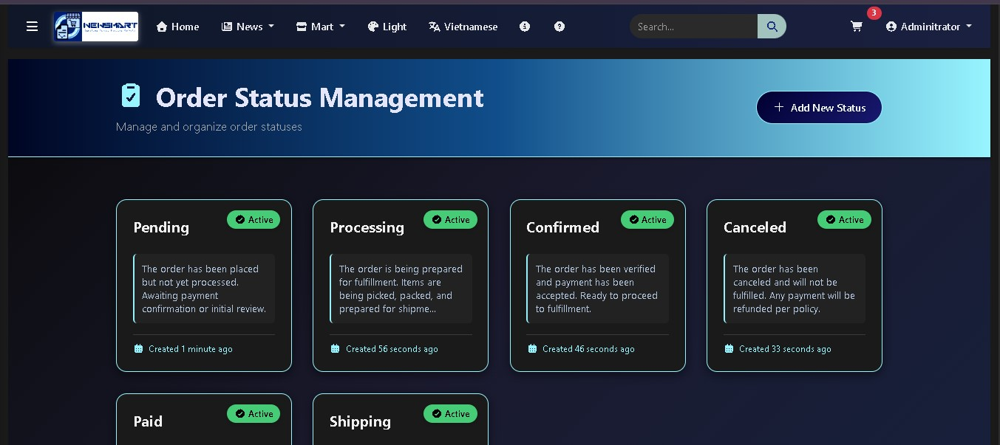

# NewsMart: An Integrated E-commerce & Content Platform 🚀

**Slogan:** **Igniting Minds, Fueling Markets!**

NewsMart is a robust, multi-role web application designed as an integrated ecosystem for e-commerce and content publishing. It is built on the powerful **Laravel** framework, ensuring scalability, security, and clean architecture.
<p align="center">
  
  
  
  
  
</p>

## 💡 Project Highlights

### Authentication
<p align="center">
  
  <br />
  <em>Log In </em>
</p>

<p align="center">
  
  <br />
  <em>Register </em>
</p>

### Management

<p align="center">
  
  <br />
  <em> Roles Management </em>
</p>


<p align="center">
  
  <br />
  <em>Brands Management </em>
</p>

<p align="center">
  
  <br />
  <em>Categories Management </em>
</p>

<p align="center">
  
  <br />
  <em>Topics Management </em>
</p>

<p align="center">
  
  <br />
  <em> Post Status Management </em>
</p>

<p align="center">
  
  <br />
  <em>Post Type Management </em>
</p>

<p align="center">
  
  <br />
  <em> Order Status Management </em>
</p>


## 🌟 Key Features

This project provides a comprehensive feature set for various user roles (Admin, Manager, Saler, Shipper, User).

### Core System & Management (CRUD Completed) ⚙️
The foundational management modules are fully implemented, allowing administrators full control over:

* **Authentication:** `Login`/`Register` fully stylized and functional.
* **Navigation:** Complete `Navbar`/`Sidebar` structure with multi-level menus.
* **System Entities:** Full **CRUD** operations for:
    * `Categories` & `Brands` (Product classification)
    * `Topics` & `PostTypes` (Content classification)
    * `PostStatus`, `OrderStatus`, `Roles`, `Configurations`, `Reviews` (System control)

---

## 💻 Tech Stack & Dependencies

This project leverages the modern PHP ecosystem to deliver a high-performance web application.

| Category | Technology | Icon | Note |
| :--- | :--- | :--- | :--- |
| **Backend** | **Laravel** (PHP) |  | The leading PHP framework for web artisans. |
| **Database** | MySQL/MariaDB |  | Robust and widely used relational database. |
| **Frontend** | Bootstrap 5, Font Awesome |  | Responsive design and rich icon sets. |

---

## 🚀 Getting Started

Follow these steps to clone the repository and set up the project locally.

### 1. Prerequisites

Ensure you have the following software installed on your machine:

* **PHP** (8.1+)
* **Composer**
* **Node.js & NPM/Yarn** (for frontend assets, if needed)
* **MySQL** or another compatible database

### 2. Installation Steps

Clone the repository and install the backend dependencies:

```bash
# 1. Clone the repository
git clone [YOUR_REPO_URL] newsmart-project
cd newsmart-project

# 2. Install PHP dependencies via Composer
composer install

# 3. Create a copy of your environment file
cp .env.example .env

# 4. Generate the application key
php artisan key:generate

# 5. Configure your database in the .env file
# DB_DATABASE=newsmart_db
# DB_USERNAME=root
# DB_PASSWORD=

# 6. Run migrations to set up database tables
php artisan migrate

# 7. Optional: Seed the database with initial data (e.g., roles, admin user)
php artisan db:seed # If you have a Seeder prepared

# 8. Start the local development server
php artisan serve
```

### 3. Frontend Assets (If Applicable)
If the project uses compiled assets (JS/CSS), run the following:

```bash
# Install Node dependencies
npm install

# Compile assets for development (or production)
npm run dev # or npm run build
```

The application should now be accessible at http://127.0.0.1:8000 (or the URL shown after running php artisan serve).